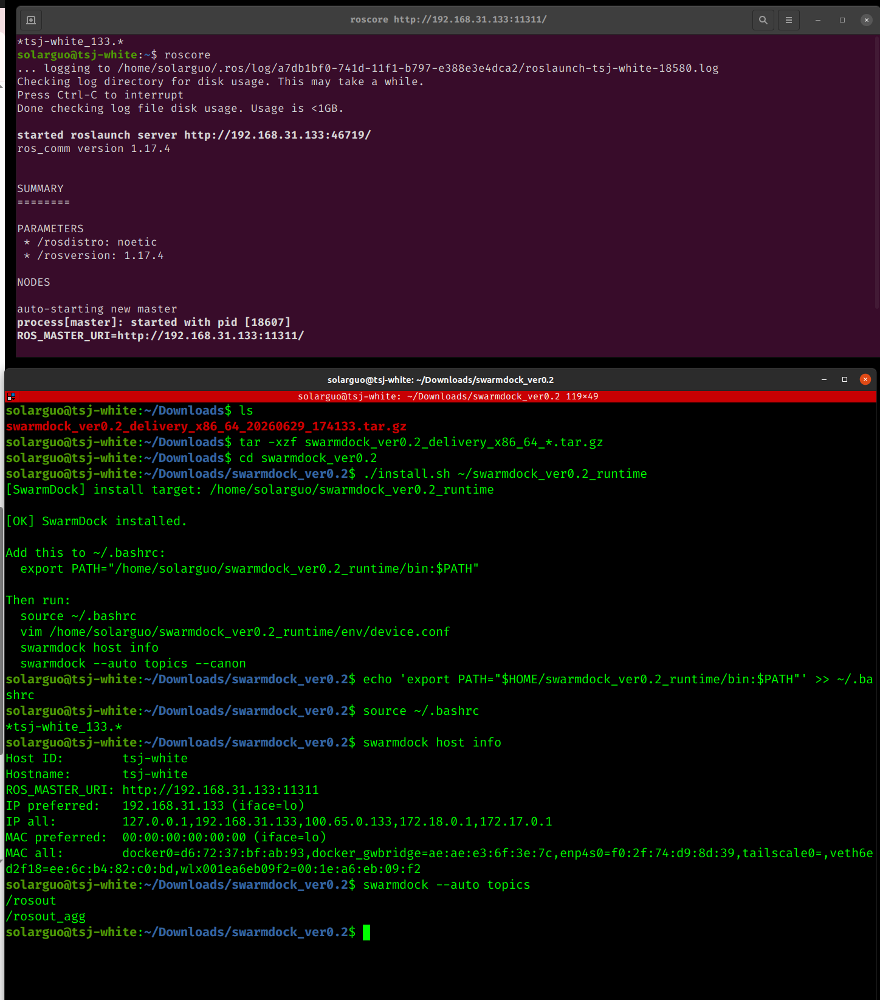

# SwarmDock ver0.2
SwarmDock is the prebuilt binary distribution of the SwarmPlug system.
SwarmPlug defines the underlying versioned infrastructure and canonical naming model for heterogeneous ROS-based systems.
SwarmDock provides a ready-to-run binary package for ROS1 discovery, host binding, and canonical resource listing.
## Features
- ROS1 Master discovery
- ROS host binding helper
- ROS topic / node / service / parameter listing
- Canonical resource naming
- Prebuilt binary distribution

Canonical output format:

```text
/sp/<host_id>/<kind>/<ros_path>
```
## Download

Please download the prebuilt package from the GitHub Releases page：
https://github.com/qyswarm/swarmdock-release/releases

Current ver0.2 packages:

swarmdock_ver0.2_delivery_x86_64_*.tar.gz

swarmdock_ver0.2_delivery_arm64_*.tar.gz

Choose the package that matches your target device.

| Package             | Target                                                               |
| ------------------- | -------------------------------------------------------------------- |
| `x86_64`            | Desktop / laptop / server Linux                                      |
| `arm64`             | Radxa, Raspberry Pi 5 / CM5, Orange Pi, and other ARM64 Linux boards |

Note: x86_64 binaries cannot run on ARM64 boards, and ARM64 binaries cannot run on x86_64 machines.

## Install on x86_64 Linux
```bash
tar -xzf swarmdock_ver0.2_delivery_x86_64_*.tar.gz
cd swarmdock_ver0.2

./install.sh ~/swarmdock_ver0.2_runtime

echo 'export PATH="$HOME/swarmdock_ver0.2_runtime/bin:$PATH"' >> ~/.bashrc
source ~/.bashrc
```

## Install on arm_64 Linux (docker-ros)
This package has been tested on Radxa with ROS Noetic Docker.
```bash
tar -xzf swarmdock_ver0.2_delivery_arm64_*.tar.gz
cd swarmdock_ver0.2_arm64

./install.sh ~/swarmdock_ver0.2_runtime

echo 'export PATH="$HOME/swarmdock_ver0.2_runtime/bin:$PATH"' >> ~/.bashrc
source ~/.bashrc
```


## Configure

Edit:

```bash
vim ~/swarmdock_ver0.2_runtime/env/device.conf
```

Example for x86_64 desktop:

```bash
export SP_NODE_ID=sd-001
export SP_HOST_ID=host-001
export PREFER_IP=192.168.31.133
export SUBNET_PREFIX=192.168.31
```
Example for ARM64 Radxa:

```bash
export SP_NODE_ID=radxa_214
export SP_HOST_ID=radxa
export PREFER_IP=192.168.31.214
export SUBNET_PREFIX=192.168.31
```
Configuration fields:
| Field           | Meaning                                     |
| --------------- | ------------------------------------------- |
| `SP_NODE_ID`    | Current SwarmDock node ID                   |
| `SP_HOST_ID`    | Host ID used in canonical naming            |
| `PREFER_IP`     | Preferred ROS Master IP                     |
| `SUBNET_PREFIX` | Subnet prefix used for ROS Master discovery |

## Usage
**Make sure ROS1 and ROS Master are available.**
Basic check:

```bash
rosnode list
```
Normal output should include at least:
```bash
/rosout
```
Run SwarmDock:

```bash
swarmdock host info
swarmdock --auto topics
swarmdock --auto topics --canon
swarmdock --auto nodes --canon
swarmdock --auto services --canon
swarmdock --auto params --canon
```
Example canonical output:
/sp/radxa/node/rosout    /rosout
/sp/radxa/topic/rosout   /rosout
/sp/radxa/topic/rosout_agg   /rosout_agg

You can also use auto mode:
```bash
swarmdock host info
swarmdock --auto topics
swarmdock --auto topics --canon
swarmdock --auto nodes --canon
swarmdock --auto services --canon
swarmdock --auto params --canon
```

## Quick Demo（X64）

The following screenshot shows a basic SwarmDock ver0.2 installation and runtime check.

It demonstrates:

- starting `roscore`
- extracting the prebuilt release package
- running `install.sh`
- adding SwarmDock to `PATH`
- checking host information
- listing ROS topics



## Quick Demo（Arm64）
It demonstrates:

- SSH login to the Radxa ARM64 device
- automatically entering the ROS Noetic Docker container
- verifying the ROS environment:
  - `ROS_NET_MODE=lan`
  - `ROS_IP=192.168.31.214`
  - `ROS_MASTER_URI=http://192.168.31.214:11311`
- checking ROS node and topic availability
- extracting the prebuilt ARM64 release package
- running `install.sh`
- installing SwarmDock into the runtime directory
- adding SwarmDock to `PATH`
- running `swarmdock --auto topics`
- listing ROS topics successfully


## Notes

This public repository provides prebuilt binary releases only.

Source code is not included in the public release package.

## License

This software is distributed as a prebuilt binary package.  
See `LICENSE.txt` for usage restrictions.
# swarmdock-release
